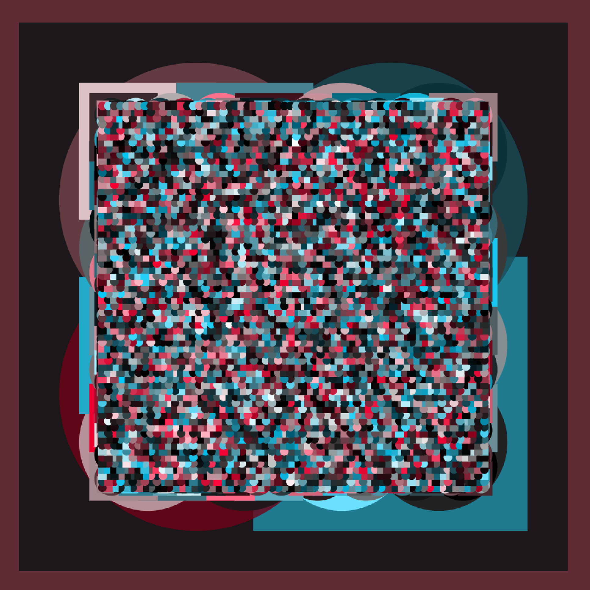
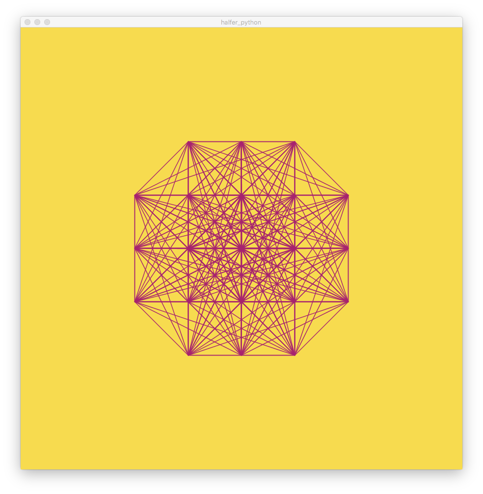

#Circles and Midpoint Exploration
Throughout this code I explored Processing's graphics by creating a canvas overlapped with various circles and creating polygons divided by their midpoints. Randomness was introduced for variation among output. Each folder contains sample images, alongside with the code and an explanation for the process behind each output image.

An example circle exploration output follows:

An example polygon exploration output follows:

